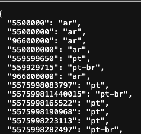
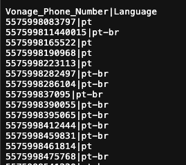

# Accor - Language Work

This project is originally hosted on the customer's VCR Workpace:
https://developer.vonage.com/en/cloud-runtime/workspaces/19359fe5-aa31-429b-a1bf-9bf051225861_starter-project?accountId=cb28378f

### The logic works as the following:
1) Check the Assets folder and find for a file
2) File name is different from the one we downloaded?
    - Yes -> Download the last one
3) Read the content
4) Return the content

- GET /language?format=text : returns raw CSV as text (default)
- GET /language?format=json : returns CSV parsed into JSON

Try these:
- https://neru-cb28378f-marketing-cloud-apis-dev.euw1.runtime.vonage.cloud/language?format=text
- https://neru-cb28378f-marketing-cloud-apis-dev.euw1.runtime.vonage.cloud/language?format=json

### Responses
Response example of a JSON content




Response example of a CSV content




### Test case
Run these URL to test all the posibilities

1. All the data - Format JSON

https://neru-cb28378f-marketing-cloud-apis-dev.euw1.runtime.vonage.cloud/language/?format=json

2. All the data - Format CSV

https://neru-cb28378f-marketing-cloud-apis-dev.euw1.runtime.vonage.cloud/language/?format=text

3. One number only  - Format JSON
It returns only the language, not the number.

https://neru-cb28378f-marketing-cloud-apis-dev.euw1.runtime.vonage.cloud/language/5575998282497/?format=json

4. One number only - Format CSV

https://neru-cb28378f-marketing-cloud-apis-dev.euw1.runtime.vonage.cloud/language/5575998282497/?format=text

5. Invalid / non-existent number - Format JSON

https://neru-cb28378f-marketing-cloud-apis-dev.euw1.runtime.vonage.cloud/language/INVALID-NUMBER/?format=json

Response:
```
{"language":"not-found"}
```

6. Invalid / non-existent number - Format CSV

https://neru-cb28378f-marketing-cloud-apis-dev.euw1.runtime.vonage.cloud/language/INVALID-NUMBER/?format=text

## Search all the files
The process searches for all CSV files uploaded, not just one.
Users can upload either .gz or .csv files. 

### Extended logic
1) User requests the server.
2) Compares the Assets folder with the local LANGUAGE folder from VCR.
3) Anything different? Any new file?
- Yes: Then download the new content to the local LANGUAGE folder in VCR
- No: That's fine. Don't do anything...

4) Proceeds with the logic as it was before. Now considering ALL the content from all files.
- Nothing is deleted from the Assets folder (I don't normally like to delete data)
- This is good in case VCR for some reason restarts and clears my local LANGUAGE folder. We won't lose any information.


